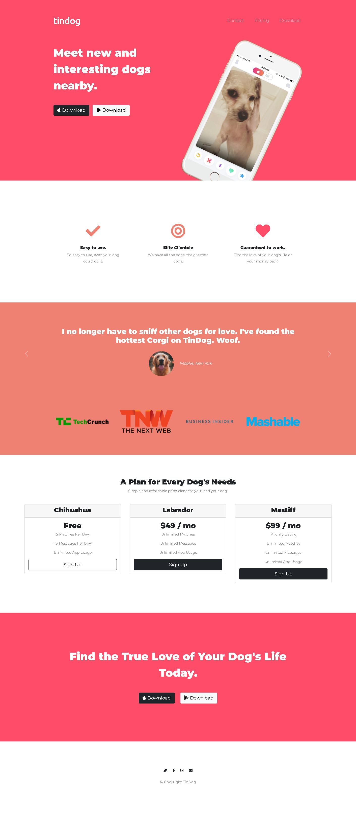

# Udemy - Intermediate Bootstrap exercise

This is my solution to the [Tindog Website exercise on Udemy](https://www.udemy.com/course/the-complete-web-development-bootcamp/). The Complete 2022 Web Development Bootcamp is the tutorial I am using to learn full-stack web development.

## Table of contents

- [Overview](#overview)
  - [Screenshot](#screenshot)
  - [Links](#links)
- [My process](#my-process)
  - [Built with](#built-with)
  - [What I learned](#what-i-learned)
  - [Continued development](#continued-development)
  - [Useful resources](#useful-resources)
- [Author](#author)
- [Acknowledgments](#acknowledgments)

## Overview

This website is a HTML, CSS and Bootstrap coding challenge from Udemy's 2022 Coding Bootcamp lectured by Angela Yu. This uses HTML, CSS and Bootstrap is to demonstrate styling and other components applied on a website.

### Screenshot

## My process

- I used text and images supplied with the challenge.
- Added the Navigation bar
- Added styling and formatting from top to bottom focusing on one section at a time.
- Added active states

### Built with

- Semantic HTML5 markup
- CSS custom properties
- Bootstrap framework

### What I learned

I learned how to use html to structure content and CSS to apply styling on the one page website and using the Bootstrap front-end framework.

Other components I learned to use:
- Bootstrap Navigation Bar, Grid Layout, Containers, Carousel, Cards
- Z-index and Stacking order
- Refactoring

### Continued development

I still have check if media queries applied are correct and to learn update media queries on this page.

### Useful resources

- [MDN Web docs - Bootstrap](https://developer.mozilla.org/en-US/docs/Glossary/Bootstrap) - This has information to understand Bootstrap.

## Author

- LinkedIn - [Mzukisi Soci](https://www.linkedin.com/in/mzukisi-soci-308521140/)
